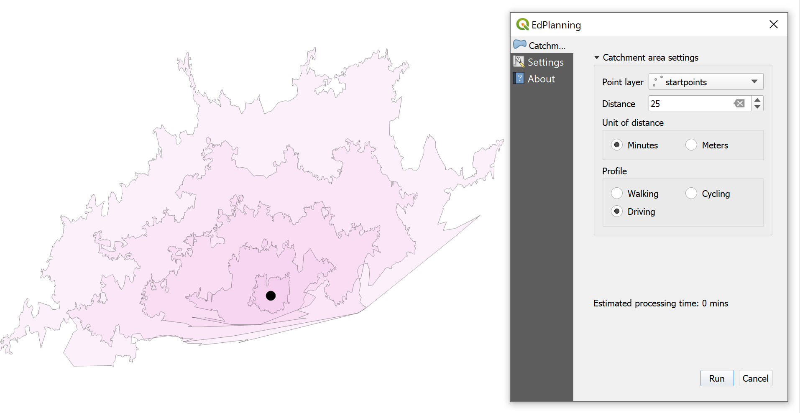
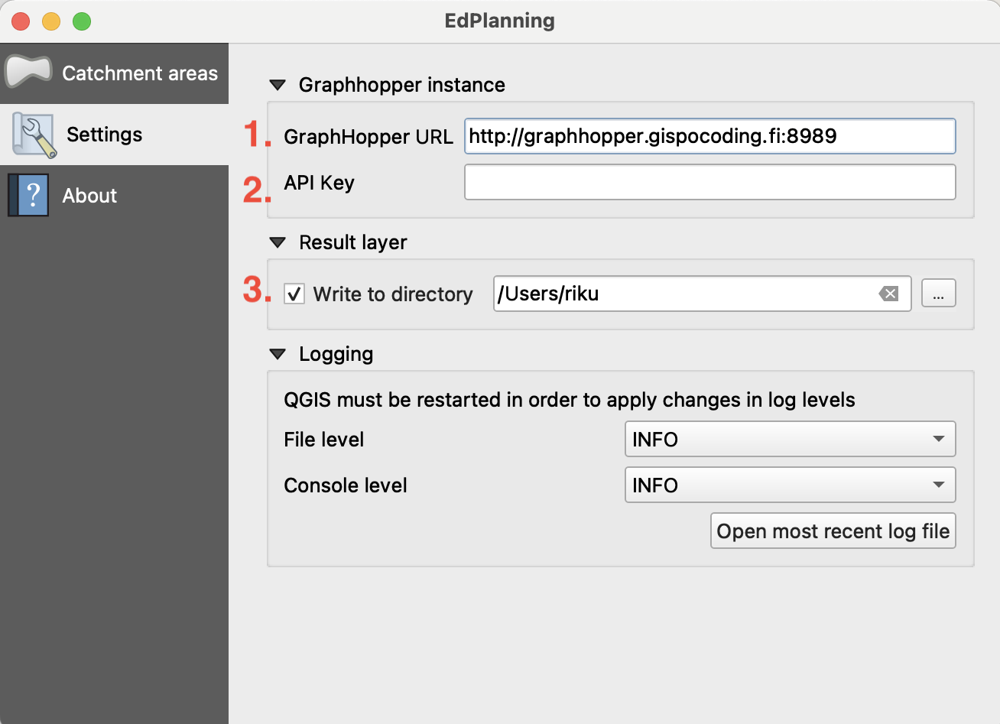
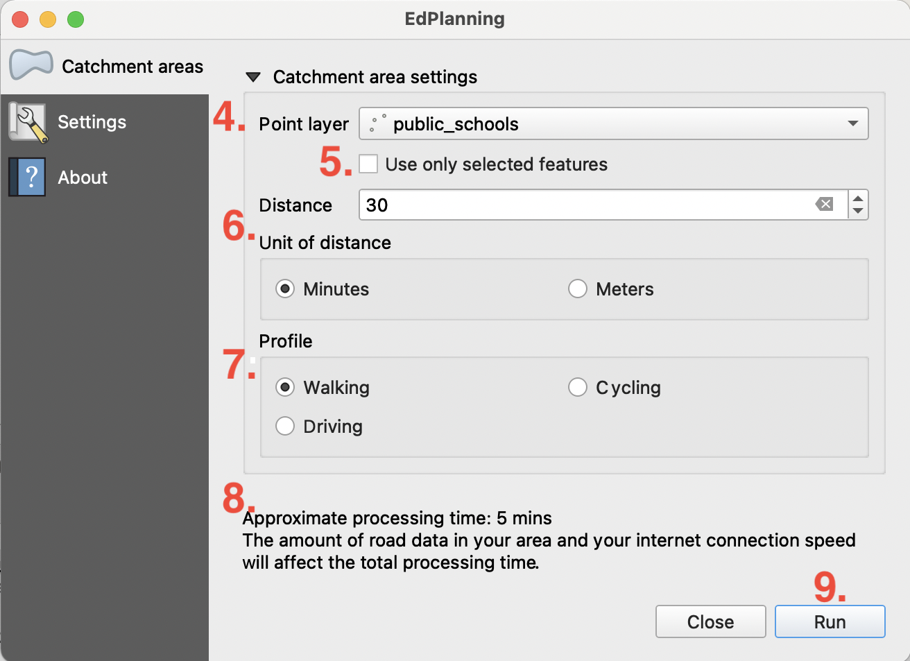

# EdPlanning

[](https://codecov.io/github/GispoCoding/edplanning?branch=master)

[](http://perso.crans.org/besson/LICENSE.html)
[](https://github.com/psf/black)
[](https://pycqa.github.io/isort/)
[](https://github.com/pre-commit/pre-commit)
[](http://mypy-lang.org/)

QGIS plugin for analysing school accessibility based on OpenStreetMap route data.



Currently, the plugin calculates catchment areas (isochrones) to a specified layer of schools with a selected mode of transport (walking, cycling, driving) and a selected distance in meters or minutes (e.g. 1 kilometer, or 30 minutes of transit).

The plugin employs the [Graphhopper routing backend](https://github.com/graphhopper/graphhopper). Therefore, you must have a Graphhopper instance running, or you may use [a commercial Graphhopper service](https://www.graphhopper.com/). The plugin assumes your Graphhopper config contains at least the following routing profiles:
```
  profiles:
    - name: hike
      vehicle: hike
      weighting: shortest
    - name: bike
      vehicle: bike
      weighting: fastest
    - name: car
      vehicle: car
      weighting: fastest
```

See the [graphhopper-docker repository](https://github.com/GispoCoding/graphhopper-docker) for simple instructions on how to set up GraphHopper using Docker. The setup and config stored in that repository works directly with the tool.

### How to get started



1. Once you know your Graphhopper address, start the plugin and select the Settings tab. Fill in the address in Graphhopper URL field.
2. If your Graphhopper subscription requires an API key, fill in the API key field.
3. If you wish to save the result layers automatically, select the checkbox and pick the directory you want to save the results in. Otherwise, the layer stays only in memory.



4. Select any point layer currently open in your QGIS project.
5. If you have filtered or selected points in the layer, you may only use selected points. Otherwise, all points will be used in the calculation.
6. Select the distance you want to travel in minutes or meters. You may calculate multiple isochrones per point ("buckets") at the same time by setting the number of distance divisions. They will be exact divisions of the total distance, and each distance will be saved in the `distance` field of the resulting isochrones. Calculating multiple isochrones per point will increase the processing time.
7. Select the mode of transit. Walking is the default and uses all Openstreetmap paths.
8. Calculation time estimate is shown based on the currently selected settings. It will warn you if the run is going to take too long.
9. Press Run to start calculating.

You may continue working in QGIS while the isochrones are fetched in the background, and you may close the dialog. The QGIS progress bar (bottom of QGIS screen) will display the process. You may cancel the calculation there. You may also start multiple calculations with different settings at the same time by pressing Run again.

### Development

Refer to [development](docs/development.md) for developing this QGIS3 plugin.

## License
This plugin is licenced with
[GNU General Public License, version 3](https://www.gnu.org/licenses/gpl-3.0.html).
See [LICENSE](LICENSE) for more information.
